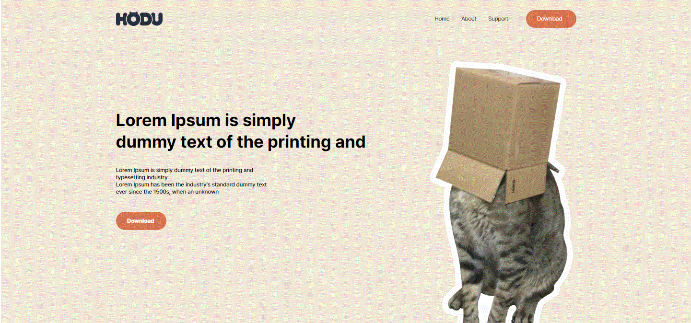
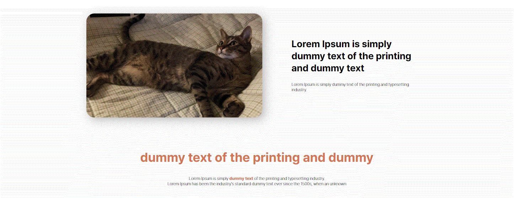
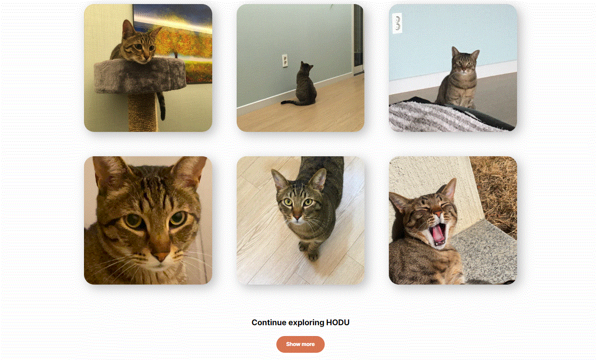
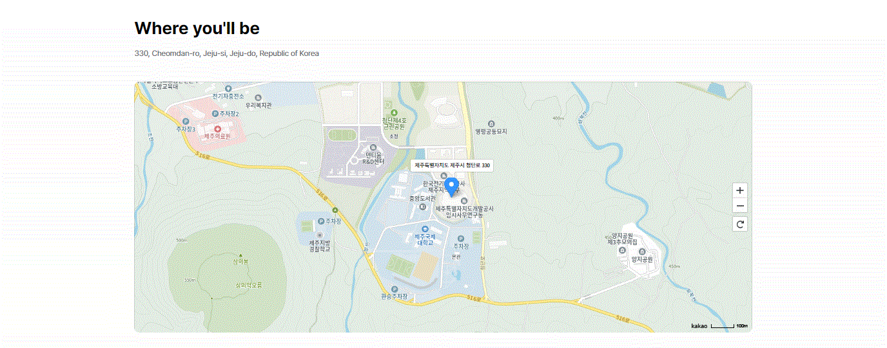
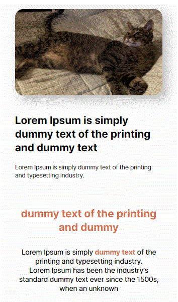
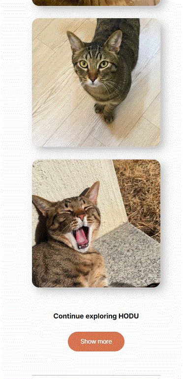
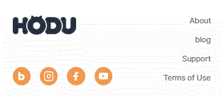

# 🤗이스트소프트 백엔드 개발자 부트캠프[6기]
## 🌐프로젝트01 - 프론트엔드 프로젝트

### ✏목표
#### 보편적 측면에서의 목표
###### 현대의 개발 환경에서는 프론트엔드와 백엔드 간의 경계가 더욱 흐려지고 있다. 이러한 맥락에서 팀 협업과 개발 역량을 향상시키기 위해 백엔드 개발자가 프론트엔드에 대한 이해를 갖추는 것이 중요하다.

#### 개인적 측면에서의 목표
###### 이번 부트 캠프 기간동안 배운 프론트엔드 관련 기술들을 최대한 연습하고 익히도록 한다.

-------------------------------------------
### ✏개발 환경 및 베포URL
##### - 개발환경 : Visual Studio Code
##### - 배포URL
###### pc-version : <https://sodami-hub.github.io/pc_hodu/>
###### movile-version : <https://sodami-hub.github.io/mobile_hodu/>
-------------------------------------------
### ✏요구사항 명세
1. 피그마를 참고하여 페이지 구현을 한다.
2. 모바일 화면도 고려하여 페이지 구현을 한다.
3. 스크롤시 헤더가 고정되게 한다.(단, 처음에는 고정된 상태가 아니다.)
4. 스크롤 탑 버튼을 구현한다.<br>
  a. 스크롤 탑 버튼은 스크롤시 나타난다.<br>
  b. 스크롤 탑 버튼은 푸터 아래로 내려가지 않는다.<br>
  c. 스크롤 탑 버튼을 누르면 스크롤이 최상단으로 올라갑니다.(단, 부드럽게 올라가야 된다.)<br>
5. 구독하기 모달창<br>
  a. 이메일을 입력하고 ```Subscribe``` 버튼을 클릭하면 모달창이 나타난다.<br>
  b. 이메일 유효성 검사를 진행해야 한다.(값이 들어가지 않거나 이메일 형식이 유효하지 않으면 alert 창으로 경고 문구가 떠야 된다.)<br>
  c. 이메일이 잘 입력되었다면 모달창이 뜬다. 이때 모달창의 ```OK! I love HODU``` 버튼을 클릭하면 form이 제출되고 모달창이 닫힌다.

-------------------------------------------
### ✏프로젝트 구조와 개발 일정
📦FRONTEND_FINAL_PROJECT  
 ┣ 📂images  
 ┣ 📂mobile_version 
 ┣ 📂pc_version

-------------------------------------------
### ✏화면 구성
<table>
    <tbody>
        <tr>
          <th colspan="2">PC-Version</th>
        <tr>
        <tr>
            <td colspan="2">header</td>
        </tr>
        <tr>
            <td>
		
            </td>
        </tr>
        <tr>
            <td colspan="2">main.section01</td>
        </tr>
        <tr>
            <td colspan="2">
                
            </td>
        </tr>
        <tr>
            <td colspan="2">main.section02</td>
        </tr>
        <tr>
            <td colspan="2">
                
            </td>
        </tr>
         <tr>
            <td colspan="2">main.section03</td>
        </tr>
        <tr>
            <td colspan="2">
                
            </td>
        </tr>
         <tr>
            <td colspan="2">main.section04</td>
        </tr>
        <tr>
            <td colspan="2">
                
            </td>
        </tr>
        <tr>
            <th colspan="2">Mobile-Version</th>
        </tr>
        <tr>
            <td>header</td>
            <td>main.section01-01</td>
        </tr>
        <tr>
            <td>
                
            </td>
            <td>
                
            </td>
        </tr>
        <tr>
            <td>main.section01-02(일부)</td>
            <td>main.section02</td>
        </tr>
        <tr>
            <td>
                
            </td>
            <td>
                
            </td>
        </tr>
        <tr>
            <th colspan="2">footer</th>
        <tr>
            <td colspan="2">
                
            </td>
        </tr>
    </tbody>
</table>

-------------------------------------------
### ✏에러와 에러 해결


-------------------------------------------
### ✏개발하며 느낀 점
