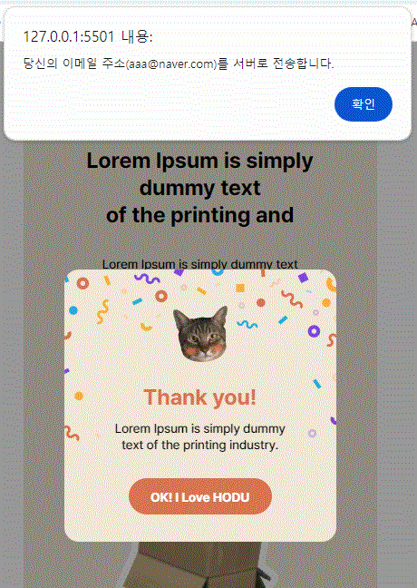

# 🤗이스트소프트 백엔드 개발자 부트캠프[6기]
## 🌐프로젝트01 - 프론트엔드 프로젝트

### ✏목표
#### 보편적 측면에서의 목표
##### 현대의 개발 환경에서는 프론트엔드와 백엔드 간의 경계가 더욱 흐려지고 있다. 이러한 맥락에서 팀 협업과 개발 역량을 향상시키기 위해 백엔드 개발자가 프론트엔드에 대한 이해를 갖추는 것이 중요하다.

#### 개인적 측면에서의 목표
##### 이번 부트 캠프 기간동안 배운 프론트엔드 관련 기술들을 최대한 연습하고 익히도록 한다.

-------------------------------------------

### ✏개발 환경 및 베포URL
#### - 개발환경 : Visual Studio Code
#### - 배포URL
##### pc-version : <https://sodami-hub.github.io/pc_hodu/>
##### mobile-version : <https://sodami-hub.github.io/mobile_hodu/>
##### 👍반응형-web👍 : https://sodami-hub.github.io/Frontend_Final_Project/
-------------------------------------------

### ✏요구사항 명세
1. 피그마를 참고하여 페이지 구현을 한다.<br> [피그마 링크]<https://www.figma.com/design/s9RCnA6dSi3QHHeMDFHKE6/EST-오르미(BE)_HTML%2FCSS%2FJS?node-id=28501-4177&t=gpv3t28WAalztcGv-1>
2. 모바일 화면도 고려하여 페이지 구현을 한다.
3. 스크롤시 헤더가 고정되게 한다.(단, 처음에는 고정된 상태가 아니다.)
4. 스크롤 탑 버튼을 구현한다.<br>
  a. 스크롤 탑 버튼은 스크롤시 나타난다.<br>
  b. 스크롤 탑 버튼은 푸터 아래로 내려가지 않는다.<br>
  c. 스크롤 탑 버튼을 누르면 스크롤이 최상단으로 올라갑니다.(단, 부드럽게 올라가야 된다.)<br>
5. 구독하기 모달창<br>
  a. 이메일을 입력하고 ```Subscribe``` 버튼을 클릭하면 모달창이 나타난다.<br>
  b. 이메일 유효성 검사를 진행해야 한다.(값이 들어가지 않거나 이메일 형식이 유효하지 않으면 alert 창으로 경고 문구가 떠야 된다.)<br>
  c. 이메일이 잘 입력되었다면 모달창이 뜬다. 이때 모달창의 ```OK! I love HODU``` 버튼을 클릭하면 form이 제출되고 모달창이 닫힌다.

-------------------------------------------
### ✏프로젝트 구조와 개발 일정
-  프로젝트 구조<br>
📦FRONTEND_FINAL_PROJECT  
 ┣ 📂images  
 ┣ 📂mobile_version<br> 
 ┣ 📂pc_version

  -   개발 일정<br>
  🙌1차 개발  
  일정 : 2024.08.19(월) ~ 2024.08.28(수) // 08.29(목) 1차 배포 <br>
  목표 : PC버전과 모바일버전의 화면을 각각 HTML/CSS, Javascript로 구현한다.<br>
  🙌2차 개발<br>
    일정 : 2024.08.31(토) ~ 2024.09.02(월) <br>
목표 : 반응형웹으로 서비스를 배포한다.
-------------------------------------------
### ✏화면 구성<br>

| PC version |
| :---: |
| **header - h1 : 호두의 웹페이지입니다.** |
|  |
| **main - h2 : 호두와 관련된 이야기, 사진, 위치, 블로그 가입 서비스를 제공합니다.** |
| main.section01 - h3 : 호두와 관련된 자료를 다운받을 수 있습니다.|
|  |
| main.section02 - h3 : 호두의 이야기 |
|  |
| main.section03 - h3 : 호두의 사진들과 더보기 서비스 |
|  |
| main.section04 - h3 : 위치서비스 |
|  |
| main.section05 - h3 : 호두의 블로그 가입 및 구독 |
|  |
| **footer - h2 : 호두의 SNS관련 링크들** |
|  |
| **Mobile version** |
| header.nav - h1 : 호두의 모바일버전 웹페이지입니다(+ menu.html).<br>main.section01 - h3 : 호두관련 다운로드 서비스 |
|  |
| main.section02 - h3 : 호두의 이야기 |
|  |
| main.section03 - h3 : 호두의 사진들과 더보기 서비스 |
|  |
| main.section04 - h3 : 호두의 위치 정보 서비스<br>main.section05 -  h3 : 호두의 블로그를 구독할 수 있습니다. |
|  |
| footer - h2 : 호두와 관련된 여러 링크들을 확인할 수 있습니다. |
|  |
| 모달 |
|   |


### ✏에러와 에러 해결
#### 😢개인프로젝트 기간동안 해결하지 못한 문제들에 대해서 정리해보았습니다.
##### 1. figma 화면과 html로 작성한 화면의 폰트 차이 : figma의 font-weight 속성을 그대로 가져왔을 때 차이가 발생하는 것으로 보인다.
##### 2. 모달 창에서의 form 제출
- 모달창이 열리자마자 바로 닫히는 현상이 발생.
- 동일한 주소를 두번 입력(Subscribe) 하면 정상 작동함.
- 개발자 도구의 디버그를 통해서 현상을 파악하게 됨.
    - 어떤 상황에서 모달 창의 확인 버튼을 누르지 않았음에도 바로 다음 단계로 넘어감.
    - 이벤트 기본 동작과 이벤트 버블링을 막는 함수를 추가했지만 변화가 없음.
    - 다음 이벤트가 발생할 때까지 대기하는 함수를 통해서 모달창이 자동으로 닫히는 현상을 막음
    - 그러나 이벤트를 막았기 때문에 input에 입력한 email 값을 전달할 수 없는 문제가 발생.
    - email 값을 javascript의 전역변수에 넣어서 전달하는 것처럼 구현.

-------------------------------------------
### 😊개발하며 느낀 점
- html/css 문서를 작성하면서 내가 잘하고 있는지 못하고 있는지 어디에 문제가 있는지에 대한 감각이 전혀 없었다. 물론 내 경험과 지식이 시작하는 단계이기 때문일 수 있지만, 프론트엔드에서 사용하는 언어들이 갖는 특징(?)인 것 같은 생각이 들기도 했다.
- 위와 같은 맥락에서 프론트엔드 과정에서 배운 언어들(html/css/javascript)의 구동 원리에 대한 궁금증이 생겼다. 
